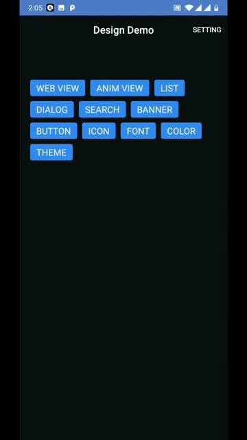
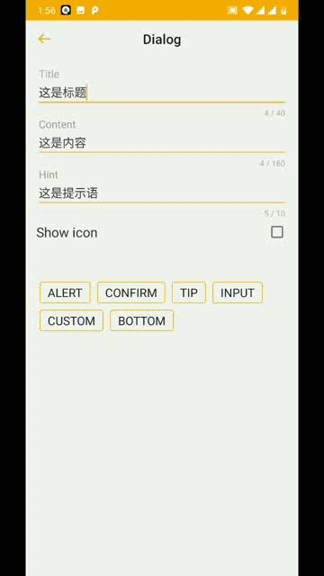
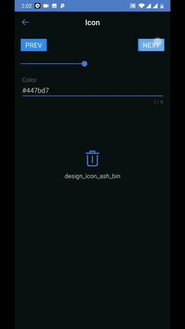
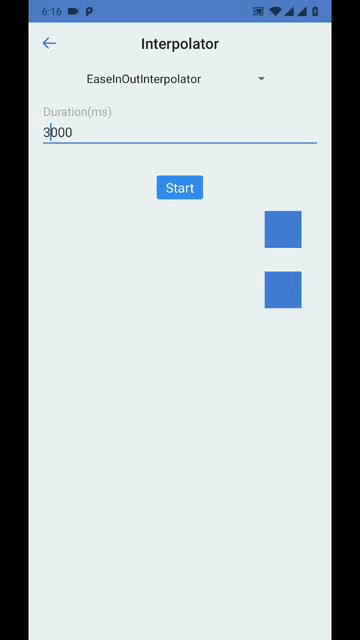

Snowball Android Design Library
============

Some ui components that helps you build applications.

## Installation

```groovy
repositories {
    maven { url "https://xueqiumobile.bintray.com/maven" }
    // if you use ShareKit component
    maven { url 'https://jitpack.io' }
}
dependencies {
    // add dependency, please replace x.y.z to the latest version
    implementation "com.xueqiu.design:design:x.y.z"
    // if you use ShareKit component
    kapt ('com.github.Hackforid.Lego:lego-compiler:0.7.5')
}
```

## Components

- [Color](./design/src/main/res/values/colors.xml)
- [Font](./design/src/main/res/values/dimens.xml)
- Icon(Svg)
- [Theme](./design/src/main/res/values/themes.xml)
- [Anim](./design/src/main/res/anim)
- UI Components
  - Dialog
  - AspectLayout
  - WebView
  - Button
  - ShareKit
  - Interpolator
  - LottieAnim
- [Design Extensions](./design/src/main/java/com/xueqiu/design/DesignExt.kt)

## Some screenshots

   

## Usage

Make your AppTheme style extends DesignTheme, then you can use the components. For more details, please read the example.

The ShareKit use [LegoAdapter](https://github.com/Hackforid/Lego) and the SnowAnimView use [Lottie](https://github.com/airbnb/lottie-android), please read their documentation before using theme.

## Proguard
```
If you use lego adapter
-keepnames class com.smilehacker.lego.factory.*
```